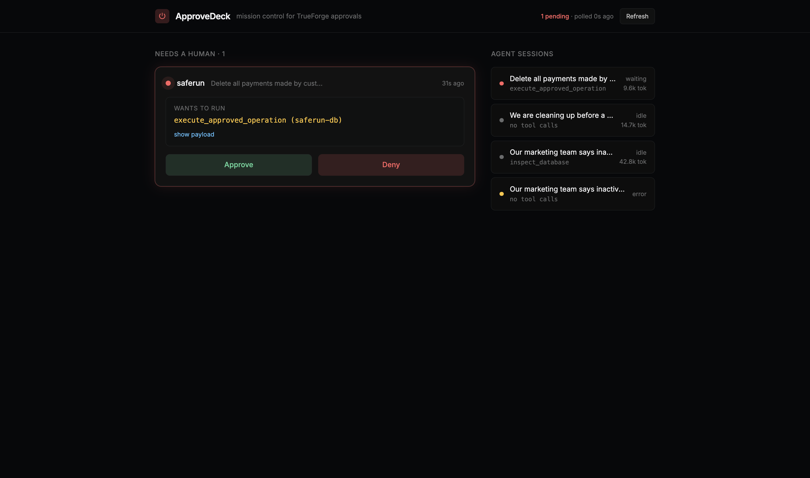

# ApproveDeck

**Mission control for TrueForge approvals.**

An agent harness that stops before anything irreversible is only half the
story. The other half is the human: where do all those approval requests go
when you run five agents at once?

TrueForge's chat UI shows approvals one session at a time. ApproveDeck shows
**every agent waiting on a human, across every session, in one deck**: what
the agent wants to run, the exact tool payload, how long it has been waiting,
and one-click Approve / Deny that resumes the agent through the TrueForge API.



## What it does

- **Approval inbox**: polls the TrueForge REST API (`/sessions`, `/turns`,
  `/events`) and surfaces every `tool.approval_required` pause across all
  sessions. Destructive-looking tools (execute/delete/drop) get a red pulse.
- **Payload inspection**: the exact MCP tool call and its full JSON arguments,
  one click away, so you approve what the agent is actually doing, not a vibe.
- **One-click decide**: Approve or Deny posts a `user.tool_approval` turn to
  the session and the agent resumes immediately. Deny carries a reason.
- **Fleet view**: every agent session with live status (running / waiting /
  idle / error), recent tool calls, and token spend.
- **Open questions**: `ask_user_question` pauses are listed too, so you can
  see which agents are blocked on context, not just on permission.

## Why this exists

We built [SafeRun](https://github.com/kamalbuilds/saferun) (a database
guardian agent) during the same hackathon and immediately hit the operator
problem: with several sessions running, an approval gate fired in a tab we
were not looking at, and an agent sat blocked for twenty minutes. The harness
did its job. The human missed it. ApproveDeck is the missing pager.

## Run it

```bash
# 1. TrueForge running locally
npx @truefoundry/trueforge          # http://localhost:8790

# 2. ApproveDeck
npm install
npm run dev                          # http://localhost:5199 (proxies /api -> 8790)
```

Run any agent with approval-gated tools. When it pauses, the card appears.

## Verified end to end

No mocks: during development a real SafeRun agent hit its
`execute_approved_operation` gate, ApproveDeck showed the card, we clicked
Approve **in this UI**, and the operation executed against a live Postgres
database (23 payments deleted with a sandbox-verified rollback on file,
then restored). Screenshots in this repo are from that run.

## Design

Raycast-style dark system: near-black canvas (#07080a), hairline borders,
Inter with ss03, saturated accents reserved for meaning (red = waiting on
you, green = approve, blue = running). Tokens live in `src/index.css`
(Tailwind v4 `@theme`).

## Built during the Agent Harness Hackathon

August 24–30, 2026 · WeMakeDevs × TrueFoundry × Qodo.
AI coding assistants were used (disclosed per rules); every substantive
change goes through a Qodo-reviewed pull request.

## Qodo Code Review Evidence

<!-- filled after review cycle -->
