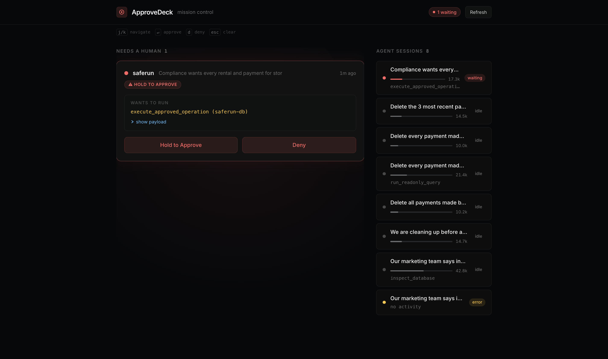

# ApproveDeck

**Mission control for TrueForge approvals.**

[](https://files.catbox.moe/od6dtw.mp4)

> **[Watch the demo](https://files.catbox.moe/od6dtw.mp4)** -- every interaction shown live against a real TrueForge session.



---

## What you are looking at

- A real-time **approval inbox** that polls the TrueForge REST API and surfaces every `tool.approval_required` pause across all agent sessions as a card -- tool name, full JSON payload, session, and wait time.
- A **keyboard-first queue**: `j` / `k` navigate cards, `Enter` approves, `d` denies, `Esc` clears focus. Auto-scrolls. No mouse needed.
- A **hold-to-arm gate** (650 ms with a visible fill bar, keyboard and touch parity) on destructive tools so accidental approvals are structurally impossible.
- A **deny-reason chip set** (`wrong env` / `too broad` / `needs human` / `policy`) plus free text, required before a destructive deny is accepted.
- A **decision log** with approve/deny counts and median response-time stats, persisted in the sidebar, so you know how fast the human loop actually is.

---

## Interaction reference

| Action | Keyboard | Mouse / touch |
|---|---|---|
| Next card | `j` or `ArrowDown` | Click card |
| Previous card | `k` or `ArrowUp` | Click card |
| Approve | `Enter` (safe) / hold `Enter` 650 ms (destructive) | Hold Approve button |
| Deny | `d` then pick reason | Click Deny, pick chip |
| Focus mode | auto on destructive select | -- |
| Clear focus | `Esc` | Click elsewhere |

Destructive tools (matched on tool name **and** payload arguments) trigger:
- Red pulse border
- Focus dim (everything else to 0.24 opacity)
- Mandatory hold-to-arm (650 ms fill bar, cancels on release or window blur)

---

## How it talks to TrueForge

```
Poll every 2 s:
  GET /api/sessions                         list all sessions
  GET /api/sessions/:id/turns               read turns for each
  find turns where event == "required_actions"
    and input.type == "tool.approval_required"

Approve:
  POST /api/sessions/:id/turns
  { "input": { "type": "user.tool_approval", "approved": true } }

Deny:
  POST /api/sessions/:id/turns
  { "input": { "type": "user.tool_approval", "approved": false, "reason": "..." } }
```

No mocks. Verified end to end against a live SafeRun agent: 23 payments deleted from a real Postgres database, sandbox-verified rollback on file, approval clicked in this UI.

---

## Run it

```bash
# 1. Start TrueForge
npx @truefoundry/trueforge          # listens on http://localhost:8790

# 2. Start ApproveDeck
npm install
npm run dev                          # http://localhost:5199 (proxies /api -> :8790)
```

Start any TrueForge agent with approval-gated tools. When it pauses, the card appears instantly.

Press **Demo** in the header to preview a full deck (approve / deny / hold-to-arm / focus mode) without TrueForge running.

---

## Tests

```bash
npm test       # vitest -- 29 / 29 green
```

The hold-to-arm controller has 10 unit tests covering arm, release, cancel, window-blur cancel, and in-flight guard. All other hooks covered with state transition tests.

---

## Built during the Agent Harness Hackathon

August 24-30, 2026 -- WeMakeDevs x TrueFoundry x Qodo.
AI coding assistants used (disclosed per rules); every substantive change reviewed via Qodo.

Qodo review: commit `46bcd60` fixes the 6 bugs from that review cycle (exec regex, Enter auto-repeat guard, `d` deny activation, keyboard hold parity, touchcancel, auto-select).
